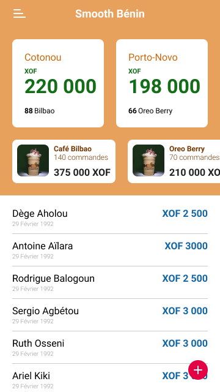
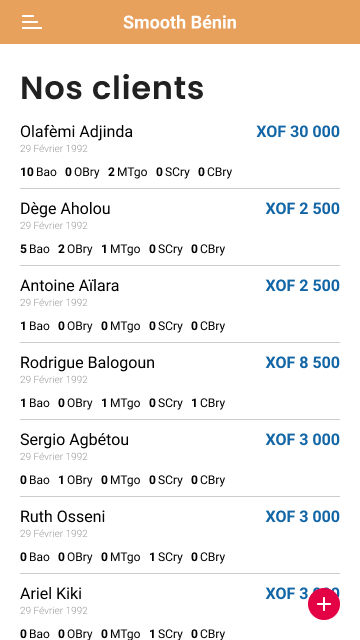

# Smooth – Smoothie Shop Management App  

Smooth is a powerful and intuitive smoothie shop management app built entirely with Flutter and Firebase. Designed to streamline the daily operations of smoothie shops, it provides efficient tools for order management, inventory tracking, customer engagement, and sales analytics. The app follows the MVVM (Model-View-ViewModel) architecture, ensuring maintainable and scalable code.  

## ✨ Features  
- **Order Management**: Manage new orders, track order status, and organize deliveries.  
- **Inventory Tracking**: Real-time stock monitoring with low inventory alerts.  
- **Customer Management**: Maintain a customer database for personalized interactions and loyalty programs.  
- **Sales Analytics**: Gain insights into sales trends and popular products.  
- **Cloud Integration**: Secure authentication and real-time data synchronization using Firebase.  
- **Cross-Platform**: Consistent user experience on both iOS and Android devices.  

## 📸 Screenshots  
| Home | Clients |
| --- | --- |
|   |   |

## 🚀 Getting Started  
To get a local copy up and running follow these simple steps.  

### Prerequisites  
- Flutter SDK (version 3.x or higher)  
- Firebase account and project setup  
- Code editor (VSCode/Android Studio)  

## 😎  Author(s)

**Elikem Medehou** 
